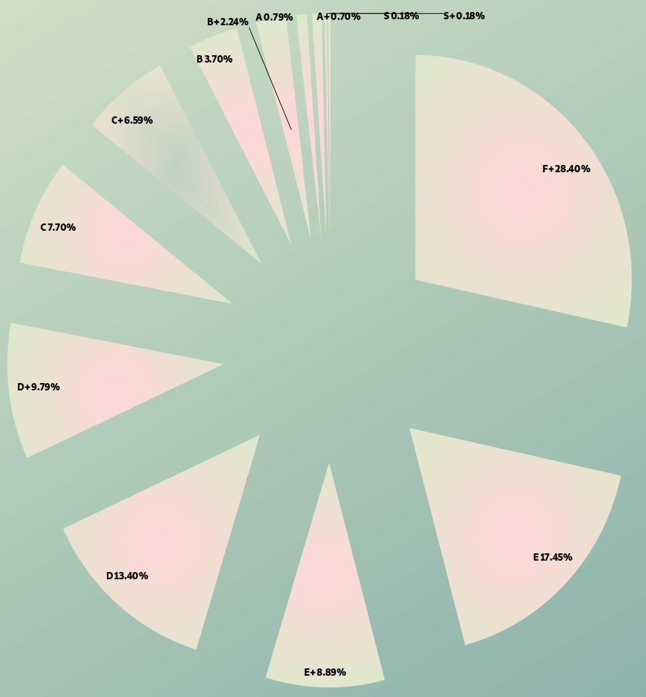

It isn't 10,000 hours that creates outliers, it's 10,000 iterations.

― Naval

Rank|Math|Explain|[Sample](https://gist.github.com/evmn/3fe266cf17d3cb1e04b7bb862977b6cf)|Percent|Top|
:-|:-|:-|-:|-:|-:
S+ | stars x followers > 30 x 7 ^ 7 | stars ≈ followers > 4970|10|0.18%|0.18%
S  | stars x followers > 30 x 6 ^ 7 | stars ≈ followers > 2897|10|0.18%|0.35%
A+ | stars x followers > 30 x 6 ^ 6 | stars ≈ followers > 1183|40|0.70%|1.06%
A  | stars x followers > 30 x 5 ^ 6 | stars ≈ followers > 684|45|0.79%|1.85%
B+ | stars x followers > 30 x 5 ^ 5 | stars ≈ followers > 306|127|2.24%|4.09%
B  | stars x followers > 30 x 4 ^ 5 | stars ≈ followers > 175|210|3.70%|7.78%
C+ | stars x followers > 30 x 4 ^ 4 | stars ≈ followers > 87|374|6.59%|14.37%
C  | stars x followers > 30 x 3 ^ 4 | stars ≈ followers > 49|437|7.70%|22.06%
D+ | stars x followers > 30 x 3 ^ 3 | stars ≈ followers > 28|556|9.79%|31.85%
D  | stars x followers > 30 x 2 ^ 3 | stars ≈ followers > 15|761|13.40%|45.25%
E+ | stars x followers > 30 x 2 ^ 2 | stars ≈ followers > 10|505|8.89%|54.15%
E  | stars x followers > 30 x 1 ^ 2 | stars ≈ followers > 5|991|17.45%|71.60%
F+ | stars x followers > 30 x 0 ^ 1 | stars ≈ followers > 0|1613|28.40%|100.00%
F  | 0 								| stars ≈ followers = 0|3686| -| -

*The sample data is collected from 9366 of [vbuterin](https://github.com/vbuterin)'s fans, dpolicastro's account can't be accessed any more, vercel.app can't work properly with sw-yx's account, I calculated it myself. Rank F data is discarded. Latest update: 2022-01-29*

<h3>I am following:</h3>

