## S+ Level Fans

<a href="https://github.com/timqian"></a>

## S Level Fans

## A+ Level Fans

<a href="https://github.com/adieuadieu"></a>

## A Level Fans

<a href="https://github.com/mayeaux"></a>

## B+ Level Fans

<a href="https://github.com/Shpota"></a>

## B Level Fans

<a href="https://github.com/onsails"></a>

## C+ Level Fans

<a href="https://github.com/aquaflamingo"></a>
<a href="https://github.com/amadeobrands"></a>
<a href="https://github.com/RanadeepPolavarapu"></a>

## C Level Fans

<a href="https://github.com/buoyantair"></a>

## D+ Level Fans

<a href="https://github.com/bigdong89"></a>

## D Level Fans

<a href="https://github.com/aaroncolaco"></a>

<a href="https://github.com/Vratislav"></a>

## E+ Level Fans

<a href="https://github.com/VagrantPi"></a>
<a href="https://github.com/lucasgelfond"></a>

## E Level Fans

<a href="https://github.com/liusy182"></a>

## F+ Level Fans

<a href="https://github.com/TumTum23"></a>

<a href="https://github.com/ipaybit"></a>

## F Level Fans

<a href="https://github.com/ClownGF"></a>
<a href="https://github.com/justbereinforced"></a>
<a href="https://github.com/OscarDiamante"></a>

