# vbuterin's Random Fans of Different Level

update: 2022-01-29

## S+ Level Fans

<a href="https://github.com/fffaraz"></a>
<a href="https://github.com/nikitavoloboev"></a>

## S Level Fans

<a href="https://github.com/lhartikk"></a>

## A+ Level Fans

## A Level Fans

<a href="https://github.com/X140Yu"></a>

## B+ Level Fans

<a href="https://github.com/prabhupant"></a>

## B Level Fans

## C+ Level Fans

## C Level Fans

<a href="https://github.com/janclarin"></a>
<a href="https://github.com/montyanderson"></a>

## D+ Level Fans

<a href="https://github.com/andres-root"></a>

## D Level Fans

<a href="https://github.com/Im2rnado"></a>

## E+ Level Fans

<a href="https://github.com/kcolford"></a>
<a href="https://github.com/geniousli"></a>

## E Level Fans

<a href="https://github.com/denismaciel"></a>

## F+ Level Fans

<a href="https://github.com/michaelc285"></a>

## F Level Fans

<a href="https://github.com/wlegate"></a>

<a href="https://github.com/WaleedBinNasir-20"></a>

